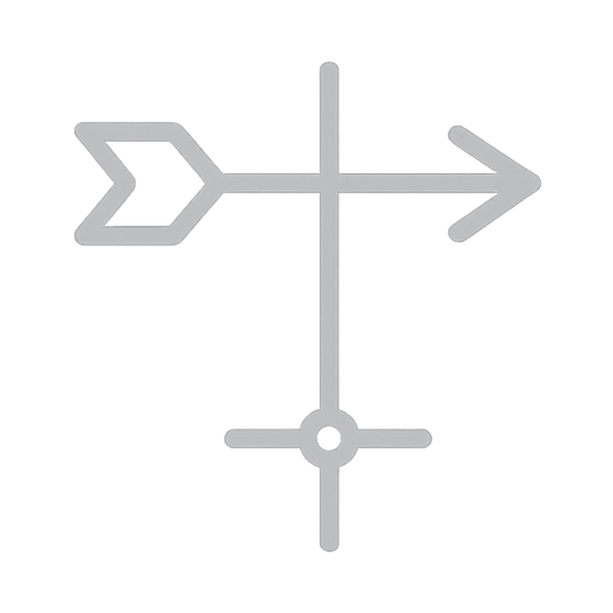
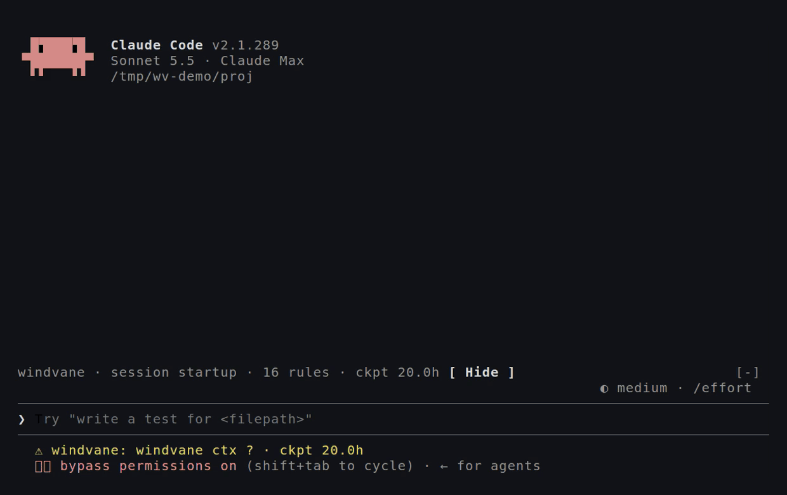

<p align="center"></p>

# windvane

Session state that survives the context window.

windvane is a Claude Code plugin that keeps the state of a session and steers it. A recorder drafts the checkpoint from what the session already did. Compaction happens at a chosen point with that state banked. The project rules and the checkpoint ride inside the compacted conversation and at the head of every subagent's prompt. Tool results are trimmed and secrets in them are redacted. Project memory and rules are a tool call away, and a token ledger, a pane and a status segment show where the session stands.

Without it, keeping a long session on track is a watch: the context fill, the moment to ask for a checkpoint, the moment to compact, whether the work was picked back up. windvane keeps that watch. The fill is read on a timer, the checkpoint is drafted when it is needed, the compaction comes at a turn boundary once the state is banked, and one prompt of windvane's resumes the work, so the model carries on without a hand on it and without stalling near a full window.

The principle: never ask the model to write what the machine can record.



## Install

```bash
git clone https://github.com/20alexl/windvane.git windvane
claude plugin marketplace add ./windvane
claude plugin install windvane@windvane
```

Python 3.10 or later must be on PATH, or named in the `python` config row or in `WINDVANE_PYTHON`. The engine has no dependencies. Set the config rows with `/plugin configure windvane@windvane`, or pass `--config KEY=VALUE` to the install command. The first interactive session offers to install the optional embedding model for memory and session search. Details are in [docs/install.md](docs/install.md).

The mod (the status segment, band, pane, tools and commands) needs an interactive session. A headless `claude -p` run gets the classic hooks only, described under [Headless and unattended](#headless-and-unattended).

## What runs on its own


Every row happens without a call from you or the model.

| Moment | What windvane does |
|---|---|
| Session start | Prints a banner with the project's rules (the ones with detectors first), the count of its own past mistakes and of the pooled ones, the restored checkpoint (whole after a resume or a compaction, a short teaser on a fresh start) ending with the repo's movement since it and the working tree now, the last session's files and activity, and recurring errors. Seeds the default rule pack once per project. Starts the background daemon. States autonomy mode when it is on. |
| You send a prompt | Captures a decision from what you typed ("let's use X", "from now on always Y"). Keeps the prompt so the destructive-command rule can see that you approved. Delivers any staged context-pressure nudge. |
| Before an edit | Warns about past mistakes tied to the file (the project's own first), an edit loop, TODO markers in a code file and the memories that match it. Checks that a proposed import resolves in the code index and lists the modules that import the file. Subagents are skipped. |
| Before a read | Once per file per session: an orientation from the code index and the file's best memories. |
| Before a shell command | Matches the command against every rule that carries a detector, records the match and shows the rule before the command runs. In autonomy mode a detector marked deny refuses the command. |
| Before any tool | In autonomy mode after a halt, denies every tool except the few that let the run leave a record. |
| After an edit | Counts the edit for the loop warning. |
| After a shell command | Tracks test runs and speaks on the first result and on each flip. Logs a recognised error as a mistake. After a search that found nothing, names the nearest symbols in the code index. |
| After a failed tool | Logs the error as a mistake unless it was a failing test run. If the error matches one seen before, shows the known fix at once. |
| After a batch of tool calls | Accounts the calls to the turn for stall detection and records detector matches on non-shell tools. |
| Plan approved or task completed | Asks for the plan to be banked as a checkpoint, or counts a finished task as a step done. |
| Turn ends | Saves an automatic handoff. If the turn edited files and nothing was banked on purpose, banks the drafted checkpoint, at most once per ten minutes. A checkpoint saved during the turn is brought up to the draft in place, with the turn's own closing reply and edits. Judges the turn for stalls. Ticks the background miner. |
| Before compaction | Banks the drafted checkpoint and indexes the transcript while the detail is still in it. |
| After compaction | Opens a new pressure cycle. The session-start banner that follows restores the state, unless the compacted conversation already carries it. |
| API failure or notification | Records the failure with its type and, for a usage limit, the reset time. In autonomy mode, sends an alert. |
| Session end | Writes the run report for a substantial session and starts the post-session miner. |

The mod adds these, in an interactive session:

| Moment | What windvane does |
|---|---|
| Every 10 seconds | Mirrors the context fill, draws the status segment and the band, and watches for the compaction point. |
| A tool result arrives | Keeps its head and tail when it passes the budget, and redacts private keys, vendor keys and literal secret values. |
| An agent is launched | Puts the project's rules, and the past mistakes for the files the prompt names, at the head of the agent's prompt. |
| A compaction finishes | Places the rules and the checkpoint right after the summary, inside the conversation. |
| A turn ends | Adds the turn's tokens and cost to the project's ledger. |

## The tools

The model calls these as `mcp__windvane__<name>`. Each takes an optional `project_path`.

- **checkpoint**: `save`, `restore`, `list`. A bare `save` accepts the drafted record. A field given amends that field.
- **compact_now**: banks the drafted checkpoint, compacts as soon as the turn ends, and resumes the work with one prompt of windvane's.
- **memory**: `remember`, `recall`, `search`, `forget`, `add_rule`, `list_rules`, `modify`, `delete`, `promote`, `archive`, `restore`, `list_mistakes`, `acknowledge_mistake`, `set_detector`.
- **log**: `mistake`, `decision`. Records what the hooks did not catch.
- **mine**: `search`, `decisions`, `errors`, `struggles`, `replay`, `timeline`, `run_report`, `run_status`, `status`. Reads the history of past sessions on the project.
- **deps**: `map`, `impact`. Asks the code index where a symbol is defined and what depends on a file.

The commands are `/windvane` (a pane with the checkpoint, the rules and the mistakes for the last file touched), `/windvane-cost` (tokens and cost, today and over all days), `/remember` (stores the selected transcript text as a decision), `/windvane-strict`, `/windvane-export` and `/windvane-import`.

## Checkpoints and compaction

The recorder drafts the whole checkpoint. It takes the task, warnings and context needed from the last checkpoint or the first prompt, the files from the session's edits, the pending and completed steps from the task list, the git commits and the carried steps the closing reply says are done (the previous record's completed steps stay, the newest twelve), and the handoff note from the closing paragraph of the last reply. The model accepts the draft with `checkpoint(save)` and no other argument, or amends one field.

A checkpoint keeps the last 20 deliberate saves per project in a ring. Restore reads this session's newest deliberate checkpoint, skipping one saved on a branch of the conversation that was rewound, and falls back to the project's newest. The answer says how far the repository moved since the save.

Compaction happens at windvane's point, not at whatever state happened to be saved. The mod mirrors the engine's pressure bands. When the fill is inside the checkpoint band and a deliberate save has landed since the band was entered, the next turn boundary compacts. `compact_now` does the same on request. The `early_compaction` row opens the band sooner, at a fill such as `40%` of the compaction window or once one turn has cost as much as `$0.40`, for a session that would rather compact a few more times than pay for a large context on every turn; the save is still required, so nothing is lost. After a compaction windvane started, the session does not wait for a person: windvane sends one prompt that resumes the work from the checkpoint, with the rules and the checkpoint arriving in the session-start brief (the `continue_after_compact` option turns this off). If neither happens, Claude Code compacts at its own trigger and the before-compaction hook banks the draft as the floor.

When the compaction finishes, one message after the summary carries the rules and the checkpoint. The session-start banner then leaves them out, so they appear once.


### Context pressure

Everything is a distance to the compaction point, not a percentage of the window. The point is the window Claude Code is configured to compact at. Auto-compaction fires 32,000 tokens under it. The checkpoint band starts 20,000 tokens above that trigger (10,000 on a 200K window), and the heads-up comes about a tenth of the window before the point. Each nudge is said once per compaction cycle. A fallback reminder comes after 60 turns with no checkpoint and no finished step.

## Memory and rules

Entries are rules, mistakes, decisions and discoveries, stored per project. A rule is never archived or decayed. A rule written at a workspace root binds every project beneath it. Rules show in the banner, before a compaction and in every subagent's prompt. File-specific mistakes show before an edit of that file.

The pack seeds on a project's first fresh session. The default tier has 16 rules: ask before destructive commands, ask before anything leaves the machine, never kill by name, search before reading, verify before claiming, finish prerequisites first, bank the checkpoint, keep secrets out of code and logs, remember what surprised you, one purpose per function, honest names, nothing left lying around, no swallowed errors, same inputs same outputs, prefer the real thing to a stand-in, and build for performance from the start. Three of them carry detectors: the destructive command, the outbound action and the kill by name.

The strict tier has 11 rules on style and workflow and is opt-in: set `strict_pack`, run `/windvane-strict`, or run `python -m windvane.rules seed --project DIR --strict`. Seeding skips any rule the project or an ancestor already has in substance. To drop a rule, call `memory(delete)` with its id. To opt out of the pack, set `default_rules` to false.

A detector is hand-written: tool names, a command regex, path globs, an input regex and a note. `memory(add_rule)` and `memory(set_detector)` take one. Every match is recorded and the rule is shown before a matching shell command runs.

## Configuration

Nine rows are set in the plugin config: `python`, `status_segment`, `result_budget`, `semantic`, `alert_command`, `strict_pack`, `autonomy`, `continue_after_compact` and `early_compaction`. Every engine setting in the table below is also a key in `.windvane/config.json` in the project or in `~/.windvane/config.json`, and an environment variable named `WINDVANE_` plus the key in capitals. The first layer that names a key wins, in this order: environment, project file, plugin config, user file.

| Key | Default | What it does |
|---|---|---|
| `structure` | false | Seed CLAUDE.md, `.learnings/` and `session-logs/` where missing |
| `default_rules` | true | Seed the default rule pack once per project |
| `strict_pack` | false | Seed the strict pack beside the default one |
| `compliance` | true | Match rules that carry a detector against tool calls |
| `autonomy` | false | Stall nudges and the halt brake |
| `alert_command` | empty | Shell command that receives one alert line |
| `goal_turn_cap` | 150 | Turns under one `/goal` before the halt is armed |
| `stall_turns` | 3 | Consecutive no-effect turns per strike |
| `stall_decay` | 5 | Consecutive good turns that remove one strike |
| `strike_cap` | 3 | Strikes before the halt (autonomy mode only) |
| `output_reserve` | 32000 | Tokens between the compaction point and where it fires |
| `checkpoint_margin` | computed | Tokens above the trigger for the checkpoint band: 20000, or 10000 on a 200K window |
| `headsup_fraction` | 0.10 | Fraction of the window before the point for the heads-up |
| `checkpoint_cadence` | 60 | Turns with no checkpoint or finished step before the fallback reminder |
| `budget_five_hour_pct` | 90 | Usage percent of the 5-hour window that nudges |
| `budget_seven_day_pct` | 95 | Usage percent of the 7-day window that nudges |
| `budget_pct` | 90 | Usage percent of any other rate-limit window that nudges |
| `live_mine` | 300 | Seconds between live mining ticks at turn end, 0 disables |
| `non_project_dirs` | empty | Comma-separated directory names that are never a project |
| `git_trace` | empty | File that logs every git call, for debugging |

The four rows not in the table are plugin rows only. They default to: `python` empty (the interpreter on PATH), `status_segment` true, `result_budget` 60000 characters, `semantic` false. `WINDVANE_PYTHON`, `WINDVANE_RESULT_BUDGET` and `WINDVANE_SEMANTIC` are their environment switches. `WINDVANE_DIR` moves the store. The full reference is [docs/configuration.md](docs/configuration.md).

## Storage

The store is `~/.windvane`, or the folder named by `WINDVANE_DIR`.

- `manifest.json` maps each project path to a hash.
- `projects/<hash>/` holds one project's memory, its checkpoint ring and the latest handoff.
- `checkpoints/` is the global ring and the per-task checkpoint files.
- `sessions/` holds per-session working files, including the context mirror.
- `config.json` holds your defaults for every project.
- The daemon's port, process id and lock files sit in the root.

Each project may also hold `.windvane/` with `config.json`, `runs/` (run reports) and `export/` (the output of `/windvane-export`).

To bring over a claude-engram store, run `/windvane-import`, or `python -m windvane.doctor --import` from the cloned folder. The import copies the memory files, the rings and the session index, leaves out per-session state and the runtime files of a live engram process, and never changes or deletes the source. A destination that already has a store is refused unless you pass `--merge`, which adds only the projects it lacks.

## What it runs, reads, writes and sends

Nothing leaves the machine. The one download is the embedding model from Hugging Face, fetched by the daemon on the first use of the semantic tier, and only when that tier is on. In detail:

**Programs it runs.** The Python interpreter named by the `python` row or `WINDVANE_PYTHON`, else `python` on PATH, with the engine's own modules from the plugin folder: the classic hook client `windvane/daemon_client.py <event>` for each hook in `hooks/hooks.json`, which asks the daemon and otherwise runs `python -m windvane.events <event>` itself; the daemon `python -m windvane.daemon`, started by the first hook client when none is running; `python -m windvane.brief` for the compaction brief and for the rules placed at the head of a subagent's prompt; `python -m windvane.tools` when the daemon is down; `python -m windvane.remember` for `/remember`; `python -m windvane.rules seed --strict` for `/windvane-strict`; `python -m windvane.export` for `/windvane-export`; `python -m windvane.migrate --import` for `/windvane-import`. The first-run offer runs `python -c "from windvane import semantic; print(int(semantic.available()))"` to see whether the semantic extra is installed, and `python -m pip install sentence-transformers numpy` only after you answer yes in its dialog. The shell command in `alert_command`, if you set one, runs with one line of text when an unattended run halts, hits a usage limit or needs input.

**What it reads.** The session's context usage from Claude Code; the session transcript and the project's files, for the recorder and the code index; Claude Code's settings and `installed_plugins.json`, to list the command hooks that would fire for an event (the bridge below); the plugin's own config rows; the text you have selected in the transcript, when you run `/remember`; the environment variables `WINDVANE_DIR`, `WINDVANE_PYTHON`, `WINDVANE_SEMANTIC`, `WINDVANE_RESULT_BUDGET`, `WINDVANE_ALERT_COMMAND`, `WINDVANE_AUTONOMY`, `WINDVANE_GOAL_TURN_CAP`, `WINDVANE_STRIKE_CAP`, `WINDVANE_LIVE_MINE`, `CLAUDE_CODE_AUTO_COMPACT_WINDOW`, `CLAUDE_CONFIG_DIR`, `HOME` and `USERPROFILE`; the daemon's port from `<store>/daemon_port`.

**What it writes.** The store under your home directory, `~/.windvane` or `WINDVANE_DIR`: the checkpoint ring, memory, rules, the ledger, the session index, and per session a context mirror (`sessions/<id>.ctx.json`), its marker (`.mod`) and the compaction brief's marker (`.briefed`). In the project: nothing, unless the `structure` setting is on (then `CLAUDE.md`, `.learnings/` and `session-logs/` are created once) or you run `/windvane-export` (Markdown under `.windvane/export/`). Settings: the plugin's `semantic` row is set to true after you accept the first-run offer, and nothing else is set; no environment variable is written.

**What it sends.** HTTP POST to the daemon at `http://127.0.0.1:<port>/hook` (a hook's stdin JSON) and `/tool` (a tool call), with the header `X-Windvane-Hook: 1`; the port comes from the store's port file. Nothing else goes anywhere.

**Prompts it submits.** One, after a compaction windvane itself started, and only when you have not typed since: "The conversation was compacted with the checkpoint banked. The rules and the checkpoint are in the session-start brief beside this message. Continue from the checkpoint: its current step first, then the pending steps. End your reply with what is done and what is next. If the person has already sent a prompt since the compaction, say so in one line and stop." The `continue_after_compact` row turns it off.

**Hooks that decide or change something.** The six `mcp__windvane__*` tools are served by `tool.call` hooks; an engine error is a deny of that call with the error's text. The `tool.call` hook for `Agent` changes one input, the prompt, by placing the project's rules and the past mistakes for the files the prompt names at its head inside `<windvane-brief>` tags; a fork, which inherits the conversation, is passed through unchanged. The `session.append` hook trims a tool result to the `result_budget` characters, keeping its head and tail, and redacts private keys, vendor keys and literal secret values before the result is stored. The `session.compact` hook places the rules and the checkpoint after the summary. The `prompt.submit` hook notes when you typed and drops windvane's own continue prompt when it is already stale; your prompts pass unchanged. The `classic.<Event>` hooks, the bridge, answer a classic hook event from the daemon when every command hook that would run for it is windvane's own, so no hook process starts; when any other hook (yours, or another plugin's) would run, they pass the event on and the command hooks run as before. There is no hook on `PreToolUse`: the pre-edit, pre-read and shell checks and the halt run through their command hooks in every session, so a permission decision is always a command hook's `deny` or Claude Code's own prompt to you. In autonomy mode only, a rule with a detector marked `unattended: "deny"` denies the matching tool call, and a halted run denies every tool but `checkpoint` and the alert.

## Headless and unattended

`claude -p` runs the classic hooks from `hooks/hooks.json`. Each one is a small client that makes one round trip to the daemon and falls back to running the handler in its own process. The mod's tools, band, pane and commands need an interactive session. Without the mod there is no context reading unless a status line script calls `python -m windvane.pressure statusline`, and the pressure nudges fall back to the turn cadence.

Autonomy mode, set with the `autonomy` row or `WINDVANE_AUTONOMY=1` (it is also on while a `/goal` runs), arms the stall ladder. A turn that changes no file, test or commit counts toward a strike. At the strike cap every tool except the checkpoint tool and a few messaging tools is denied until a person runs `python -m windvane.stall release <session_id>`. Detectors marked deny refuse the call instead of only recording it.

`alert_command` is a shell command that receives one line when a run halts, hits a usage limit or waits for input. `{message}` in the command is replaced with the quoted line. Without that placeholder the line arrives on stdin. Nothing is sent when the row is empty.

## Lineage

windvane replaces claude-engram, an earlier project that is no longer public. It is the same engine rewritten as a plugin, and the import command above brings an engram store over.
