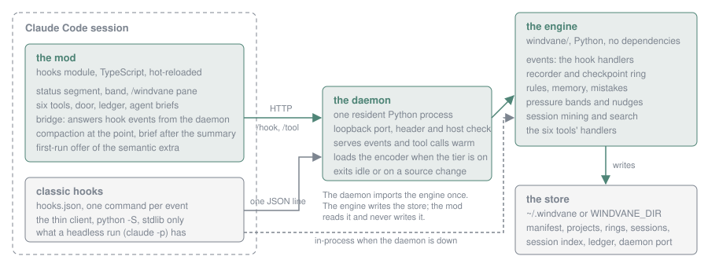
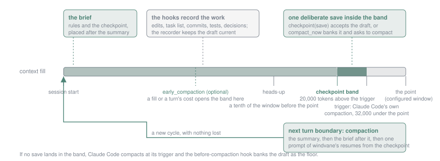

# How it works

## Three parts

windvane has a mod, an engine and a daemon.

- The **mod** is the hooks module in `hooks/`, written in TypeScript and loaded by Claude Code in an interactive session. It draws the status segment, the band and the pane, registers the six tools and the commands, trims tool results, rewrites agent prompts, compacts the conversation and keeps the ledger.
- The **engine** is the Python package in `windvane/` at the root of the plugin. It holds the memory store, the checkpoint ring, the recorder, the rules, the mining of past sessions and every hook handler (the `events` subpackage). It has no dependencies. The mod runs it as `python -m windvane.<module>` with the plugin folder on the module path, so nothing has to be installed beside the plugin.
- The **daemon** is one resident Python process that keeps the engine's imports loaded and answers requests on a loopback port. A cold hook process pays interpreter start and the package imports before any work. The daemon pays them once.

The store, `~/.windvane` or the folder `WINDVANE_DIR` names, is the only thing the parts share. The mod reads it directly (the checkpoint age, the rules, the pane) and never writes it. The engine writes it.

## The hook events

`hooks/hooks.json` declares the classic hooks. These are what run in a headless session, and in an interactive one whenever the bridge does not take over. Each is a command that runs a small client, `daemon_client.py`, with the event name:

| Event | Handler | Timeout |
|---|---|---|
| UserPromptSubmit | prompt | 5 s |
| PreToolUse on Edit or Write | pre-edit check | 3 s |
| PreToolUse on Read | pre-read orientation | 3 s |
| PreToolUse on Bash or PowerShell | rule detectors | 3 s |
| PreToolUse on every tool | the halt | 3 s |
| PostToolUse on Bash or PowerShell | test tracking, error logging | 3 s |
| PostToolUse on Edit or Write | edit counting | 3 s |
| PostToolUse on ExitPlanMode or TaskUpdate | milestone | 3 s |
| PostToolBatch | turn accounting | 3 s |
| PostToolUseFailure | error logging, known fixes | 3 s |
| Notification | alert in autonomy mode | 3 s |
| StopFailure | failure record | 5 s |
| PreCompact | bank the draft | 10 s |
| PostCompact | open a new cycle | 5 s |
| SessionStart | banner | 10 s |
| Stop | handoff, draft, turn judgment | 5 s |
| SessionEnd | run report, miner | 5 s |

The timeouts are in seconds, as `hooks.json` states them. The client reads the hook's JSON on stdin. For the tool-path events (prompt, the three PreToolUse handlers, the halt, the post-edit and post-bash handlers, the failure handler and the batch handler) it makes one round trip to the daemon and prints the answer. For the lifecycle events, and whenever the daemon is down or answers with an error, it runs the real handler in its own process and then asks for a daemon to be started for the next call. The client is run with `python -S` and imports only the standard library, so a daemon round trip is far cheaper than a cold handler.

The handlers never raise into Claude Code. A handler that fails produces no output.

## The recorder

Most of a checkpoint is already recorded somewhere, so the recorder drafts the whole record and the model accepts or amends it. It reads, and only reads, these sources:

- **The previous record.** This session's newest deliberate checkpoint on the live branch of the conversation. If the session has none, the project's newest deliberate checkpoint lends only its warnings and context needed, because another session's task and pending steps are not this one's.
- **The transcript.** The session's edits (the files), its task list (open tasks are pending, finished ones are completed and join the previous record's completed steps, the newest twelve kept, the newest in-progress one is the current step), its git commits, its first typed prompt (the task when nothing carries forward) and the last assistant reply. The closing prose paragraph of the reply is the handoff note; lists are the body of a reply and do not count, and a line about the save itself stands only when nothing else does. A list the reply heads "Done" is read as completed steps, and one headed "Next", "Not done", "Pending" or "Remaining" as pending steps when the task list names nothing. A closing sentence that says a carried pending step is done, with no negation, closes that step.
- **The hook state.** Test runs, a staged claim that a step finished, the session start and the decisions stored this session.

Every failure leaves a field empty. The draft never raises. Each saved record notes which fields came from the draft.

The draft is banked in three ways: the model calls `checkpoint(save)` with no fields (a deliberate record), the before-compaction hook banks it as an automatic record, and the turn-end hook banks it as an automatic record when the turn edited files and nothing deliberate was banked, at most once per ten minutes per session.

The CHECKPOINT NOW note asks for the save after the step in hand, not before it: finish the step, save, end the turn, and the turn boundary compacts with a record that describes the finished work. A record saved in the middle of a turn still describes only the turn so far, and even a save made after the edit drafts its summary from the previous turn's reply, because the turn's own closing reply is not written yet. The turn-end hook brings a record saved during that turn, or edited past since, up to the draft in place, same task id, still deliberate; the before-compaction hook does the same when windvane's compaction at the turn boundary comes first. A field the draft filled at the save, or one the save left empty, takes the fresh draft; a list the model wrote keeps its items and gains the draft's new ones; a string the model wrote, and the pending steps it typed, stay as written. The record notes which fields were refreshed and when.

## The ring

Checkpoints and handoffs are one construct. Each project directory in the store keeps a history of its last 20 deliberate saves and a pointer to the latest record. An automatic record only contends for the pointer, under a guard: a trivial automatic record (no files, no decisions, no real next steps) is dropped, and an automatic record does not replace a deliberate one unless it is at least as substantive or the deliberate one is a day old. This keeps a per-turn automatic entry from evicting real checkpoints.

A deliberate save is also written to the global ring in `checkpoints/`, as a per-task file, and as a `HANDOFF.md` beside the ring. A restore reads the project's own ring, then its descendants' and its ancestors', and the global ring only when none exist. `checkpoint(list)` shows the ring with index 0 first, and `checkpoint(restore)` takes that index.

## Pressure bands and the compaction point

Hooks receive no context figures, so the mod measures them. Every 10 seconds it reads the session's usage, writes the context mirror and a marker file under `sessions/` and draws the status segment; the percentage there is the fill against the compaction window, the figure `/context` shows. The engine reads the mirror for its nudges, and the mirror records the window the mod measured against as `compaction_point`.

The compaction point is the number of tokens at which Claude Code is set to compact. An environment variable, a launch flag or a settings value moves it, and the mod asks the session for the figure it uses. Auto-compaction does not fire at the point. It fires about 32,000 tokens under it, which leaves room for the model's output. Three thresholds follow from that, all distances to the point and not percentages of the window:

1. The **heads-up**, about a tenth of the window before the point: finish the step, start nothing long.
2. The **checkpoint band**, a fixed margin above the trigger (20,000 tokens, or 10,000 on a window of 200K or less): finish the step in hand, bank a checkpoint and end the turn.
3. The **trigger**, where Claude Code compacts.

Each nudge is said once per compaction cycle. A cadence reminder fires after 60 turns with no deliberate checkpoint and no finished step, and a reminder to bank also follows a turn whose closing message claims a step done when the turn changed something and no checkpoint was saved. A task closed through the task list gets the same reminder at the next prompt, only when its turn ended without a save.

The mod adds the compaction itself. When the fill is inside the checkpoint band and a deliberate save has landed since the band was entered, the next turn boundary compacts, with a toast naming the size. The `early_compaction` row opens the band below the engine's margin: at a fill given as a percentage of the compaction window, or once the last counted turn cost at least the dollar figure given (the ledger's own measure, the session's priced cost across the turn). The mod marks the mirror when the band is open for that reason, so the engine's CHECKPOINT NOW nudge fires there and names the row. The save is still required before anything compacts, and the engine's own band above the trigger stays as the floor. `compact_now` banks the draft and asks for the same compaction at the turn boundary, because a session cannot be compacted while a turn runs. Any compaction, windvane's or Claude Code's, opens a new cycle.

A compaction a plugin starts runs beneath that plugin's own hooks, so for its own compaction windvane cannot place the rules and the checkpoint inside the conversation the way it does for a `/compact` or an automatic one. Two things stand in. The session-start brief that follows every compaction carries them (the `compact_now` bank is a deliberate record, so the brief restores exactly what was banked). And once the compaction has happened, windvane sends one prompt that resumes the work from the checkpoint; without it the session would sit idle until a person typed. A prompt the person typed while the compaction ran is queued by Claude Code and runs first, so in that case windvane sends nothing: the person has already continued. The `continue_after_compact` option turns the prompt off altogether.

## What rides through a compaction

A compaction replaces the conversation with a summary the model wrote under pressure. Once it finishes, the mod asks the engine for the rules block and the checkpoint the session-start banner would restore, and places one message right after the summary. The checkpoint is this session's own newest deliberate one, with rewound branches skipped, or the project's newest as the fallback. Its last line says how the repo moved since the record was written, then HEAD and the working tree counts, so the resumed session knows the shape of its uncommitted work. The mod then writes a marker, `sessions/<id>.briefed`. While the marker is under two minutes old, the session-start banner for the compaction leaves out the rules and the checkpoint instead of repeating them.

A subagent starts from its prompt alone. When the model launches one, the mod rewrites the prompt with a header holding the project's rules and, for each file the prompt names (at most eight), the past mistakes recorded for it. The engine renders both, so they read as they do in the banner and the pre-edit check. The rules are cached for 60 seconds, and a fork, which inherits the whole conversation, passes through untouched.

## The door

Every tool result passes a door before it is stored and read. Text over the budget keeps its head (three quarters of the budget) and its tail, with one line between them naming how many characters were cut. Private key blocks, vendor keys recognised by prefix (AWS, GitHub, OpenAI style, Slack) and literal values assigned to a key, token or password word are replaced with `[redacted]`. The shapes are narrow on purpose, since a redaction that mangles a file's text breaks the next edit. Your own prompts and the model's replies are not touched.

## The bridge and the census

In an interactive session the mod can answer the classic events itself, with no hook process. For each event it reads which command hooks would fire, from the four settings sources and the enabled plugins' hooks, which it calls the census and refreshes every 60 seconds. If every hook that would fire is windvane's, and the daemon serves each of their types, the mod posts the event to the daemon and turns each handler's output into the event's result.

In any other case it passes the event on and the command hooks run as before. A module that answered alone would stop every command hook beneath it, other plugins' included, so the bridge never does that when another hook is in play. It also passes the event on when hooks are disabled, when the daemon has no port file, or when a request fails before any handler ran. A request that timed out may have run, so it is not repeated through the command hooks. The next 30 seconds go to the command hooks while the daemon recovers. The session-end event is always left to its command hook, because a request may never be sent while Claude Code exits.

## The tools

Each call goes first to the daemon, `POST /tool` with the call's arguments, the session id and the session's working directory, and to `python -m windvane.tools` with the same request on stdin when the daemon is down. The model reads the answer's text. An error comes back as a denied call with the reason. A request that timed out after 60 seconds is not retried, and the model is told to check its effect first.

## The daemon

The daemon binds a random port on 127.0.0.1 and writes it to `daemon_port` in the store. It holds a process lock for its lifetime, so only one runs per store. It exits after 30 idle minutes, set by `WINDVANE_DAEMON_TIMEOUT` in seconds, or as soon as the package's source files change on disk. The next hook starts a new one. Hook events are served from the first moment. Dispatch is serialised, since the handlers share per-call state, and each takes a few milliseconds when warm.

One listener serves two protocols, chosen by the first line of a connection. The thin client sends a JSON line. The mod sends HTTP, `POST /hook` and `POST /tool`, which must carry the `X-Windvane-Hook: 1` header and a loopback host if they send one. A web page can neither add that header across origins nor pass the host check through DNS rebinding, so a browser cannot drive the handlers.

With the `semantic` extra installed and the tier requested, the daemon also loads the sentence encoder in the background and answers scoring and embedding requests with it. Otherwise it never imports the encoder.

A session search keeps the index it read, up to two of them, while the file is unchanged: the chunks, their lowercased previews and an inverted word index. The first search of a large index takes a few seconds and a few hundred megabytes of memory; the searches after it answer a keyword query in well under a second.

## What runs headless

A `claude -p` run has no mod. It runs the classic hooks through the client: decision capture, the pre-edit, pre-read and shell checks, test and error tracking, stall judgment, the halt, the alerts, the before-compaction draft, the turn-end handoff, the banner and the run report. It has no tools, no band, no pane, no ledger, no door and no brief inside the compacted conversation. The session-start banner restores the rules and the checkpoint after a compaction instead.

Context readings come from the mirror. With no mod, the mirror is written by a status line script that calls `python -m windvane.pressure statusline`. If none is configured, the session-start banner says so and only the cadence nudges run.
